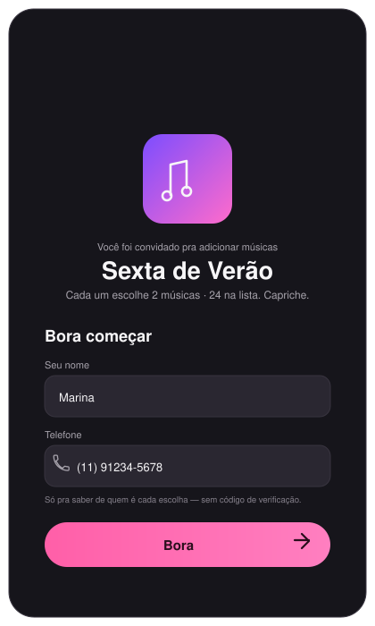
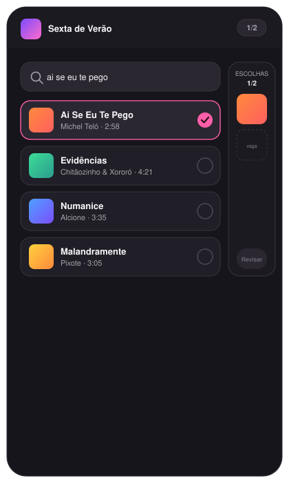
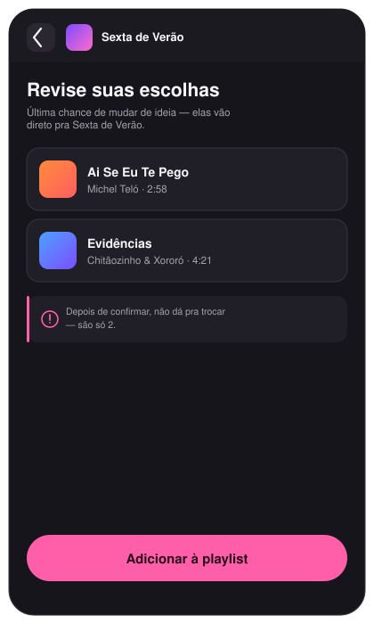
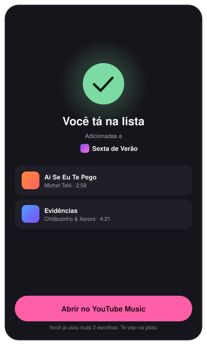
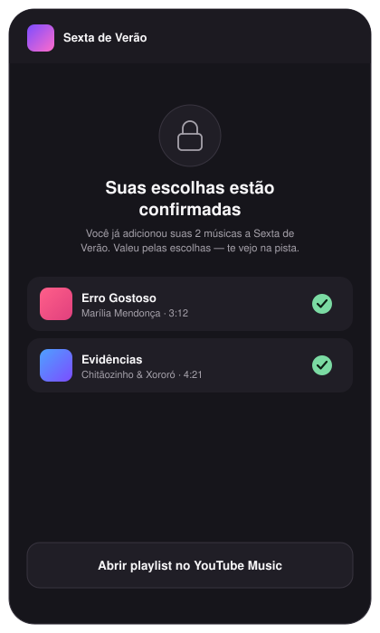

# Playlist Picker


Let friends add 2 songs each to a YouTube Music playlist you own. Friends
identify themselves with just a name + phone number (no OTP, no Google
login) — the app itself holds *your* YouTube authorization and adds their
picks on your behalf, enforcing the 2-song limit per phone number.

Single Vercel project:

- `/src` — React (Vite) frontend
- `/api` — serverless functions: YouTube Data API v3 search, playlist
  inserts, and status/submit routes backed by Supabase
- `/supabase/schema.sql` — the two tables + Postgres functions the API
  routes depend on

The frontend and API deploy together (same origin, no CORS needed) and
friends never touch your Google account — only you authorize once.

## Screens

A friend opens the link, joins with just a name and phone number, picks 2
songs, and confirms — that's the whole flow:

<table>
  <tr>
    <td align="center"><br><sub>Join</sub></td>
    <td align="center"><br><sub>Search &amp; pick</sub></td>
    <td align="center"><br><sub>Review</sub></td>
    <td align="center"><br><sub>Success</sub></td>
    <td align="center"><br><sub>Already picked</sub></td>
  </tr>
</table>

## 1. Create a Supabase project

1. Go to [supabase.com](https://supabase.com/) and create a free account
   and a new project.
2. Once it's provisioned, open **SQL Editor > New query**, paste in the
   contents of [`supabase/schema.sql`](supabase/schema.sql), and run it.
   This creates two tables (`youtube_auth`, `submissions`) and the Postgres
   functions the API uses to enforce the 2-song limit atomically.
3. Get your credentials from **Project Settings** (Supabase has split this
   across two pages recently):
   - **Data API** page → the **API URL** shown there → `SUPABASE_URL`
   - **API Keys** page → the **Secret key** (`sb_secret_...` on newer
     projects) or the legacy **service_role** key on older ones →
     `SUPABASE_SERVICE_ROLE_KEY`. Either works the same way with this app —
     both bypass Row Level Security, which is what lets the API routes
     read/write. Do **not** use the **Publishable**/`anon` key — that one's
     meant to be public and would let anyone bypass the 2-song limit if
     used here. Never expose the secret/service_role key to the browser or
     prefix it with `VITE_`.

## 2. Create a Google Cloud project + OAuth credentials

You (the playlist owner) need to authorize this app to manage your YouTube
playlist. This is a one-time setup only you do — friends never touch Google.

1. Go to [console.cloud.google.com](https://console.cloud.google.com/) and
   create a new project (or pick an existing one).
2. In the sidebar, go to **APIs & Services > Library**, search for
   **YouTube Data API v3**, and click **Enable**.
3. Go to **APIs & Services > Google Auth Platform** (this used to be called
   "OAuth consent screen" — same thing, Google renamed it).
   - On first visit it'll walk you through **Branding**: user type
     **External** (unless you have a Google Workspace org), an app name
     (e.g. "Playlist Picker"), your email for support and developer contact.
   - You can skip adding scopes — the app requests them directly.
   - Go to the **Audience** tab. **Click "Publish App" to move Publishing
     status from "Testing" to "In production."** This matters for two
     reasons: while in "Testing," only accounts explicitly added under
     "Test users" on this same tab can complete the OAuth flow at all (a
     `403: access_denied` otherwise) — and even for a test user, Google
     expires the refresh token every 7 days, which would silently break the
     app for your friends a week in. "In production" removes both
     restrictions. You'll still see an "unverified app" warning during
     consent (expected and harmless for a personal app with this scope) —
     Google's full verification review isn't required unless you want the
     warning gone.
4. Go to **APIs & Services > Credentials > Create Credentials > OAuth client
   ID**.
   - Application type: **Web application**.
   - Name: anything, e.g. "Playlist Picker".
   - Under **Authorized redirect URIs**, add both (you'll use the first for
     local testing, the second once deployed):
     - `http://localhost:3000/api/auth/callback`
     - `https://YOUR-APP.vercel.app/api/auth/callback`
   - Click **Create**. Copy the **Client ID** and **Client Secret** shown.

## 3. Find your playlist ID

Open your playlist in YouTube Music or YouTube, and copy the ID from the
URL: `https://music.youtube.com/playlist?list=THIS_PART_HERE`.

## 4. Configure environment variables

```bash
cp .env.example .env
```

Fill in `.env` with the values from steps 1–3.

## 5. Install dependencies and run locally

```bash
npm install
npx vercel dev
```

`vercel dev` runs the frontend and the `/api` serverless functions together
at `http://localhost:3000`, so all requests are same-origin — no CORS setup
needed. The first run will ask you to link a Vercel project; either link to
one you've already created on [vercel.com](https://vercel.com/) or let it
create one for you.

(If you just want to iterate on the UI without touching the API, `npm run
dev` runs the Vite dev server alone — API calls will fail without `vercel
dev` running too.)

## 6. Connect your YouTube account (one time)

With the app running, open **http://localhost:3000/api/auth/google** in
your browser and sign in with the Google account that owns the playlist.
Approve the consent screen (click **Advanced > Go to Playlist Picker
(unsafe)** if you see the unverified-app warning — expected, see step 2).
You'll see a confirmation page when it's done.

The token is stored in your Supabase `youtube_auth` table and refreshes
itself automatically — you shouldn't need to redo this unless you revoke
access or delete the row.

## 7. Deploy to Vercel

```bash
npx vercel --prod
```

Then in the Vercel dashboard, go to your project's **Settings >
Environment Variables** and add everything from your `.env` file
(`GOOGLE_CLIENT_ID`, `GOOGLE_CLIENT_SECRET`, `GOOGLE_REDIRECT_URI` — update
this one to your production callback URL, `YOUTUBE_PLAYLIST_ID`,
`SUPABASE_URL`, `SUPABASE_SERVICE_ROLE_KEY`), then redeploy so the new
values take effect. Once it's live, repeat step 6 against your production
URL (`https://YOUR-APP.vercel.app/api/auth/google`) to authorize the
deployed app — the local connection from step 6 only applies to local dev.

Now you can share `https://YOUR-APP.vercel.app` with friends anywhere, not
just your local network.

## How the 2-song limit works

Every submission is keyed by phone number in Supabase. The check-and-
reserve happens atomically inside a Postgres function (`reserve_slots` in
`supabase/schema.sql`), which takes a row lock — so two friends submitting
at the same moment (even hitting separate serverless instances) can't both
slip past the limit. If a friend's phone already has 2 songs, the app shows
them a locked-out screen with what they added instead of the search flow.

## Notes on API quota

The YouTube Data API's default quota is 10,000 units/day. Searching costs
~101 units and adding a song costs ~50 units per request, so this comfortably
supports normal party-sized usage (dozens of friends). If you hit the quota,
Google Cloud Console shows usage under **APIs & Services > YouTube Data API
v3 > Quotas**.
